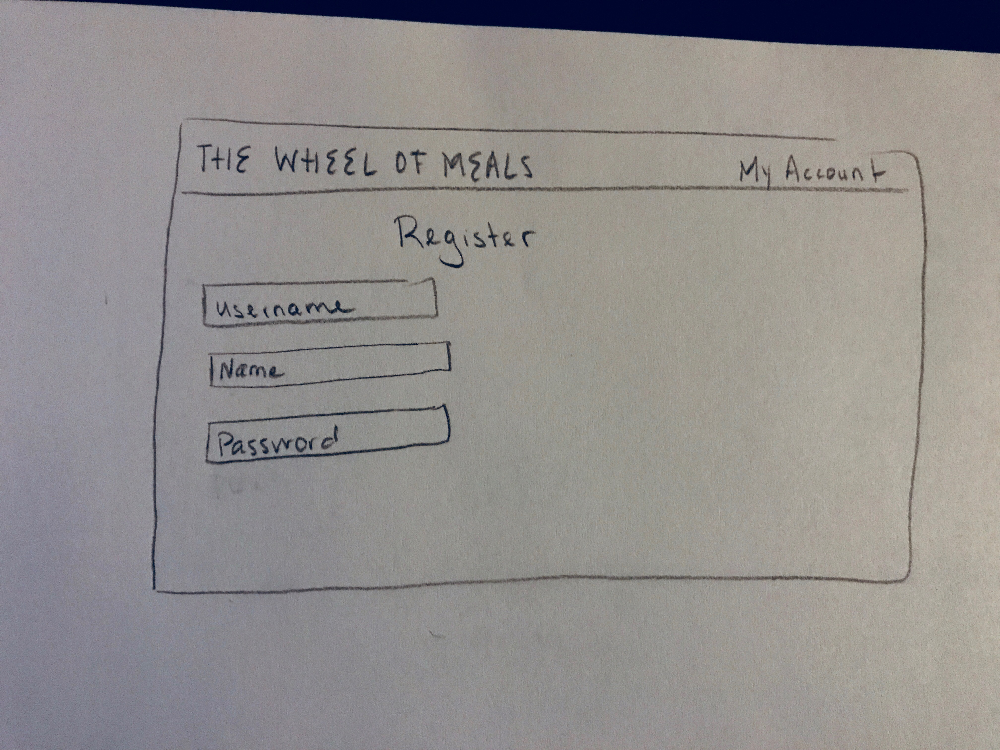

# The Wheel of Meals

## Overview

I'm here to answer the million dollar question: "Where are we eating for lunch?" So much time is spent deciding, debating arguing over where to eat meals. Now, with The Wheel of Meals, you can let go of the responsibility of deciding on what to eat and leave it to fate. You, your friends, family, and coworkers and choose a local restaurant with confidence! 

The Wheel of Meals is a web app that will allow users to randomly get assigned to a place to eat at. Users can register and login but are not required to. Having a profile, however, saves past destinations, and allows users to rate a past eating experience (for personal documentation purposes and to filter out unwanted food establishments). Once a user logins or decides to proceed without an account, they may enter their location. They then click a button titled, "Where am I going to eat today?". A random restaurant near their desired location is generated in return. The restaurant is shown on a map. A user may then choose to "spin the wheel" again if they choose. Then the user proceeds to the restaurant and enjoys their stress free meal planning.


## Data Model

The Wheel of Meals will store Users and Food Establishments. 

The application will store Users, Lists and Items

* users can have restaurant lists (via references)
* each restaurant list stores information

User Schema will include the following info. The user general info is stored as entered, except for their password, which is encrypted and hashed in to the database to preserve safety and user protection.

An Example User:

```javascript
{
  name: 'dwight shrute'
  username: "beetfarmer123",
  hash: // a password hash,
  restuarantlists: // an array of references to Restuarant documents
}
```


Restaurant Schema will include the following. The latitude and longitude data is stored to integrate with the Google Map.

An Example Restaurant:

```javascript
{
  name: "McDonalds",
  address: "208 Varick St New York, NY 10014",
  latitude: "800",
  longitude: "-450.2",
  added: "yelp" //used to filter out user additions and main data
}
```


## [Link to Commented First Draft Schema](src/db.js) 

## Wireframes

/sigin - page for signing into account


/register - page for registering an account



/home - page for selecting desired location and inputting favorite restaurant spots


/home/decision - page with restaurant result


/account - page to view account details and a log of past experiences


## Site map

[site map](documentation/sitemap.jpeg)

## User Stories or Use Cases

1. as non-registered user, I can register a new account with the site
2. as a user, I can log in to the site
3. as non-registered user, I can proceed without signing in or making an account
4. as a user, I can input my desired location
5. as a user, I am given a food establishment destination and its location on a map.
6. as a user, I can choose to have another restaurant picked for me
7. as a user, I can change my location
8. as a user, I can save my picked restaurant
9. as a user, I can go into my account and rate my past experiences with a thumbs up or down.


## Research Topics

* (5 points) Integrate user authentication
    * I plan to create general log in and registration with passportJS 
    * As a new user, you can register by filling in the required fields (username must be unique)--> and immediately after submitting form (assuming everything is entered correctly), the page will reload and you can now enter your username/password fields to log in
* (4 points) Integrate Google Maps API/Visual
    * I plan to learn how to implement the Google Maps API, with pinned locations to appear on the map
    *  It's a new and interesting skill for me, so is I've given it 4 points
* (3 points) Use a new CSS Framework
    * I plan to use materialize.css because I like how modern the style sheets are and want to enhance my css skills with it.


## [Link to Initial Main Project File](src/app.js) 

## Annotations / References Used

1. [passport.js authentication docs](http://passportjs.org/docs) - (add link to source code that was based on this)
2. [Google Maps API Docs](https://developers.google.com/maps/documentation/javascript/) - (add link to source code that was based on this)
